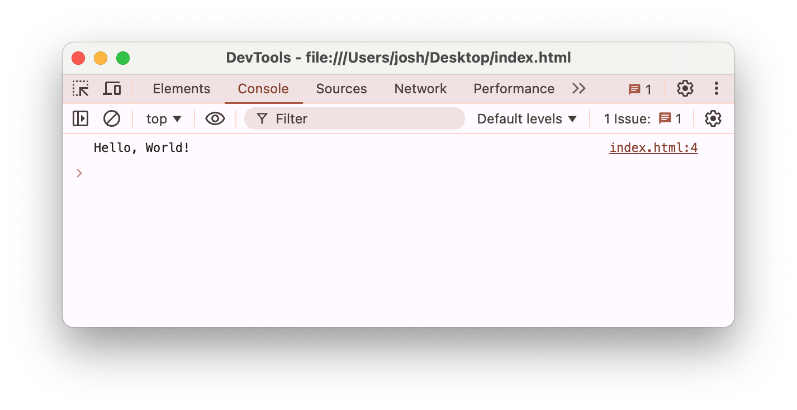

# JavaScript 101

## JavaScript = JS

---

# Javascript

## HTML
<v-click>

- what is on the page: words, text fields
</v-click>

## CSS
<v-click>

- how do things look: colors, spacing
</v-click>

## JS
<v-click>

- how do things work: what happens when I press this button
</v-click>

---

# What's JavaScript?

- JS is a _programming_ language
- HTML and CSS are _markup_ languages

<v-click>

## What is a program?
</v-click>

<v-click>

- List of instructions
- Computer runs one instruction, then the next one, and so on.
</v-click>

<!--

Pick a student, give them three instructions:
- Put your hand up
- Say your name
- Put your hand down again

This is a program.

-->

---

## Your first program

- You can add a script tag into your HTML:

```html
<html>
<body>
  <h1>My first program</h1>
  <script>
    console.log("Hello, world!");
  </script>
</body>
</html>
```

---

- Look at the Javascript console in the Chrome Developer Tools!
- Open them with Option + Command + I (press these keys: ⌥⌘I)



---

## Another way to run JavaScript

Or, you make a separate file, named (for example) `index.js`:

```js
// Javascript goes here
console.log("Hello, world!");
```

and then link it in your HTML:

```html
<html>
  <head>
    <script src="index.js"/>
  </head>
  ...
```

Check out your console

---

## Your second program

```js
// This is a comment
let name = "Greg";
let isTheTeacher = true;
let temperatureToday = 16;

console.log(name);
console.log(isTheTeacher);
console.log(temperatureToday);
```

---

## Variables

- The computer needs to remember information ("data") that we give it.

<v-click>

- Variables store data. Think of them like containers in a cupboard that keep things needed
  for later. The containers have a label, and contents.
- Variables have a label (**name**), and a content (**value**)
</v-click>

<v-click>

- This is **why** we use variables. **How** do we use variables?
</v-click>

<!--

Pause and ask "what is data"?
The current temp outside. Your name. Our company name. It's all data to the machine.

Make an example. I want to write a program that tells me the weather here for today.
Which data might this program need?
- Where am I?
- What day is it?
- What time is it?
- Would you like your weather in degrees celsius? Or farenheit?

-->

---

## Variables

- Variables need to be **declared** before they're used in any way.
- **Declare**: let the computer know you want a new container
- Declare a variable with the `let` keyword.
- **Assign**: put something in the container

```js
// These two lines have the same effect...
let name;       // Declaration
name = "Greg";  // Assignment

// ... as this one line
let name = "Greg"; // Declaration and assignment
```

<!--
when we reassign, what happens?
-->

---

## Declaration and Assignment

<div class="grid grid-cols-5 gap-2 pt-24">
<div class="text-green-800 text-center">let</div>
<div class="text-red-400 text-center">nameOfPerson</div>
<div class="text-blue-400 text-center">=</div>
<div class="text-purple-400 text-center">"Greg"</div>
<div class="text-orange-400 text-center">;</div>
<v-click>

<div class="text-green-800 text-center pt-2 border-t border-green-800">`let` keyword</div>
<div class="text-red-400 text-center pt-2 border-t border-red-400">variable name</div>
<div class="text-blue-400 text-center pt-2 border-t border-blue-400">assignment operator</div>
<div class="text-purple-400 text-center pt-2 border-t border-purple-400">variable value</div>
<div class="text-orange-400 text-center pt-2 border-t border-orange-400">semicolon</div>
</v-click>
</div>

---

## Reassign

```js
// I'll make an app for people named 'Greg'
let name = "Greg";

// You know what I changed my mind
name = "Homer";

```

<!--
How often can we reassign a variable?
Can we assign the same value to two or more variables?
-->

---

## Types of data

- Just like food containers can store many types of food (liquid, solid, powdered),
  variables can store many types of data.
- Depending on the type, you can do different things with a value.

---

## Most Common Value Types:

- String: a string of characters
  - `"Hello"` `'99 pizzas'` `"Seize the day, put very little trust in tomorrow"`
- Number: either whole numbers ("integers") or fractions ("floats")
  - `5`, `2349857239845`, `0`, `-2`,
  - `3.1`, `-1.2`, `0.0000000001`, `3.1415927`
- Boolean: yes or no
  - `true` or `false`.

<!--
What's the difference between Hello and 99 pizzas? Double/single quotes
Which line is integers which line is fractions?
Which boolean means yes, which means no?

Ask for a piece of data for each.
What could our program need in terms of strings?
What could our program need in terms of integers?
What could our program need in terms of floats?
What could our program need in terms of booleans?
-->

---

## Most Common Value Types (cont'd)

- `null`: Literally 'nothing', not zero, not an empty string (`""`), just nothing.
- `undefined`: Literally "we haven't said yet what it is", not zero, or an empty string, or `null`.

<!--
  Go for a variables exercise in a JavaScript REPL.

  Ask for data to be remembered from the crowd
  Ask the student operating the keyboard to declare that data as a variable.
  Repeat until all students have had a turn declaring a variable.

  Drive home the idea that variables don’t need to reflect reality. You can
  have a variable named “whatYearIsItToday” with a value of 2050 – variables just
  hold any information we give them.
-->

---


---

## Value Types (Example)

- We're programming a rating app.
- A user is directed to select a score between 1 and 3 by clicking.
- What would the following values each mean? `null`, `undefined`, `2`

Here's the rating app:

<div class="border border-gray-200 rounded-md p-4 flex flex-col">
Please rate this slide!

<div class="grid grid-cols-4 my-8">
<div class="flex flex-col items-center gap-2">
  <input type="radio" name="result" id="radio-na"/>
  <label class="text-center" for="radio-na">No idea</label>
</div>
<div class="flex flex-col items-center gap-2">
  <input type="radio" name="result" id="radio-1"/>
  <label for="radio-1">1</label>
</div>
<div class="flex flex-col items-center gap-2">
  <input type="radio" name="result" id="radio-2"/>
  <label for="radio-2">2</label>
</div>
<div class="flex flex-col items-center gap-2">
  <input type="radio" name="result" id="radio-3"/>
  <label for="radio-3">3</label>
</div>
</div>
<div class="grid grid-cols-2 gap-2">
<button
  class="p-2 rounded-md bg-gray-200 mt-2"
  onclick="document.querySelectorAll('input[type=\'radio\']').forEach((el) => el.checked = false);">
  Reset
</button>
<button
  class="p-2 rounded-md bg-green-200 mt-2"
  onclick="alert('Thank you for rating!')">
  Submit rating
</button>
</div>
</div>

---

## Statements

- A Javascript program is made up of multiple statements.
- Most statements end with a semicolon (`;`)
- There are many different types of statements.
- The first statements we used were _variable declaration and assignment_

```js
let name;          // Statement 1
name = "Greg";     // Statement 2
let age = 93; let home = "Smith Street" // Statements 3 and 4
name = "Peter"; age = 23; home = "NYC"; // Statements .. ?
```

---

## Statements (cont'd)

- Another type of statement is a _function call_
- _Function calls_ tell the computer to _do something_
- `console.log(<something>)` tells the computer to output
  something to the JavaScript console
- We'll talk more about this in a later lesson

```js
console.log("Hello");
let greeting = "Hello"; console.log(greeting);
```

---

## Function call

<div class="grid grid-cols-5 gap-2 pt-24">
<div class="text-green-800 text-center">console.log</div>
<div class="text-red-400 text-center">(</div>
<div class="text-blue-400 text-center">"Hello"</div>
<div class="text-purple-400 text-center">)</div>
<div class="text-orange-400 text-center">;</div>
<v-click>

<div class="text-green-800 text-center pt-2 border-t border-green-800">function name</div>
<div class="text-red-400 text-center pt-2 border-t border-red-400">open parenthesis</div>
<div class="text-blue-400 text-center pt-2 border-t border-blue-400">parameter</div>
<div class="text-purple-400 text-center pt-2 border-t border-purple-400">close parenthesis</div>
<div class="text-orange-400 text-center pt-2 border-t border-orange-400">semicolon</div>
</v-click>
</div>

<!--
Why semicolon?
Because almost every statement ends with a semicolon!
-->


---

## More facts about variables

- Naming convention for JS vars is camelCase
- Can see variable type using `typeof <variable>`

```js
let name = "Johnny Neutron";
console.log(name); // outputs "Johnny Neutron"
console.log(typeof name); // outputs "string"
```

---

## Pop Quiz

- You're storing some information in variables. Which data type is best used for
  the following:
  - the first sentence in a book
  - the current temperature outside
  - an answer to the question "are you hungry?"
  - the number of characters in a string

---
layout: center
---

# Recap

