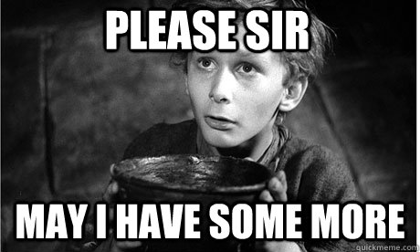

# JavaScript 102

---
layout: center
---

# 101 review

<!-- review 101 through the students' solutions to 101's activities -->

---

# More Javascript


---
layout: split
---

## Evaluation / "Running" the program

- How does the computer run the instructions of a program?

<!-- What are the instructions called? 'Statements' -->

<v-click>

- It 'evaluates' them. Evaluating a statement starts like this:
1. Take all variables from the statement and replace them with their value.
2. Do any calculations. Anything in parentheses comes first.

</v-click>

::right::

<v-click>

```js {*}{lines: true}
let name = "Gregory";
let age = 35;
console.log(name);
console.log(age + 3);
```
</v-click>
<v-click>

```js {*}{lines: true}
// During evaluation, the
// program is transformed
// by the computer.
let name = "Gregory";
let age = 35;
console.log("Gregory");
console.log(38);
```
</v-click>

---

```js {*}{lines: true}
let name = "George";
let age = 35;
let year = 2024;

// Exercise 1
console.log(name);

// Exercise 2
let nextYear = year + 1;
console.log(nextYear);

// Exercise 3
console.log(year - age);
```

<!-- A little evaluation exercise. Play computer with
  the students and have them evaluate these snippets!

  Pass the laptop with a REPL and have the student
  replace the variables with their values;

  Answer 1:
  console.log("George");

  Answer 2:
  let nextYear = 2024 + 1;
  let nextYear = 2025;

  Answer 3:
  let birthyear = 2024 - 35;
  let birthyear = 1989;
  -->
---

## `let` and `const`

- Some variables change, some don't

- We know we can declare variables with the keyword `let`:
- `let name = "Greg";`

- Variables declared with `let` can be changed ('reassigned'):
- `let name = "Kaia"; name = "Maia";`

<!--
- Ask for examples of information that never change
  - Examples → which town you were born in, what day you were born on, which
    weekday today’s date is

- Ask for examples of information that can change
  - Examples → what you had for breakfast (might be different tomorrow). How
    often you’ve used the bathroom today. What is your heart rate.
 -->

---

## `let` and `const`

- We can also declare variables with the keyword `const`:
- `const gregsBirthYear=1991;`

- Variables declared with `const` **cannot** be reassigned:
- `const year = 2024; year = 2025;`

<v-click>

- If you try anyway, it will produce an error:
- `Uncaught TypeError: Assignment to constant variable.`
</v-click>

<!--

## Explain the difference of constant and non-constant declarations

- Illustrate that instead of `let` you can use `const`
- Illustrate that it doesn’t matter if the information is actually change-able,
  but only that it stays the same _throughout the program_. `const` and `let` have
  meaning to Javascript, not to us per se.

-->

---

# Reassigning `const`

```js {1-3,5-8}{lines: true}
let temperature = 20;
temperature = 18; // Ok
temperature = 15; // Ok

const temperature = 20;
// Produces "Uncaught TypeError:
// Assignment to constant variable."
temperature = 18;
```

---
layout: center
---

## Work through the HTML and CSS articles on MDN
---
layout: center
---

# POP QUIZ

<!--
- A variable needs to be declared before it can be used
  - What happens when we try to access a variable that hasn’t been declared?
  - What happens when we try to assign to a variable that hasn’t been declared?
    (remember to `'use strict'` if you want to demonstrate, or use https://repljs.com)

- A variable can be `let` or `const`
  - What’s the difference?
  - Give an example of a change-able fact that you want to declare as `const`
-->

---

## Find the errors

```js {1,2,4,5-6,7-8}{lines: true}
lot javascript = "cool";
CONST pizza = "tasty";

console.log(age);
let age;
console.log(age);
age = 21;
console.log(age);
```
<!--
  Show some Javascript to be evaluated. Ideally only show one line at a time,
  starting with the top example. If you can, don’t use VS code as the syntax
  highlighting and linter will give away the problems too easily. Ask students
  if there’s an error _or_ what the line outputs.
-->

---
# layout: center
---

# More JavaScript


---

## Conditionals (`if` / `else`)

- Sometimes an instruction should only be done **if** a certain condition is true
- Let's make a program to tell the user if they are old enough to enter a music venue.
  Anyone 18 or older, is old enough to enter.

```js
let age = 19;
console.log("You are old enough to enter.")
```
<v-click>

- What happens if we change the age to 16?
- Now the user is no longer old enough to enter the venue.
- Do we have to re-write the whole program?
</v-click>

<!--
Ask students to raise their left hand if their name is <pick the name of one student>, otherwise their right hand.
Ask multiple students including the student that is actually named so.
-->

---

- We can use `if` and `else` to build **conditional** statements.

```js
let age = 19;

if(age >= 18) {
  console.log("You are old enough to enter.")
} else {
  console.log("You are too young to enter.")
}
```
---

<div class="grid grid-cols-4 gap-2 pt-24">
<div class="text-green-800 text-center">if</div>
<div class="text-red-400 text-center">(</div>
<div class="text-blue-400 text-center">age >= 18</div>
<div class="text-purple-400 text-center">)</div>
<v-click>

<div class="text-green-800 text-center pt-2 border-t border-green-800">keyword `if`</div>
<div class="text-red-400 text-center pt-2 border-t border-red-400">open parenthesis</div>
<div class="text-blue-400 text-center pt-2 border-t border-blue-400">condition</div>
<div class="text-purple-400 text-center pt-2 border-t border-purple-400">close parenthesis</div>
</v-click>
</div>

<!--

Ask students to actively identify the condition in preparation for asking them again on the next
slides

-->

---

```js {3-5|7-9|*}
let age = 19;

if(age >= 18) {
  // Only executed if condition is `true`
  console.log("You are old enough to enter the venue.")

} else {
  // Only executed if condition is `false`
  console.log("You are too young to enter the venue.")

}
```

<!--

Ask students to identify the condition

Bonus unlock: students believing they are not good at math

Ask students to be honest for a moment.
Raise your hand if you don't think you're good at math.
Hands down.
Raise your hand if you think you need to be good at math to become a successful software engineer.
Hands down.

Ask the 'weak math' students:
- is 5 greater than 0?
- is 2 the same as 5?

... that's the kind of math you need.

-->

---

## What is `true`, what is `false`?

- We can compare things in Javascript using `==`, `<`, `<=`, `>`, and `>=`

- `1 == 1` &rarr; this is true
- `1 == 2` &rarr; this is false
- `false == false` &rarr; this is true
- `8 < 1000` &rarr; this is true
- `8 > 1000` &rarr; this is false

---

- Remember: conditions, just like other statements, get their
  variables replaced when they're executed:

```js
let age = 19;
if(age >= 18) ...
```

- After replacement, this code becomes:

<v-click>
```js
let age = 19;
if(19 >= 18) ...
```

</v-click>

<v-click>
```js
let age = 19;
if(true) ...
```

</v-click>

---

## Boolean algebra

- To do calculations with `true` and `false`, we can't use `+` or `-`.
- We need boolean operators! `&&` and `||` are the most common.

<!--
Recap:

What's an operator?
What's an operand?

5 + 7 -> name operators and operand 1, operand 2

5 * 7 -> name operators and operand 1, operand 2

true && false -> name operators and operand 1, operand 2
-->

---

# `&&`, pronounced **AND**

```js {1,2,3,4}{lines:true}
true && true == true
true && false == false
false && true == false
false && false == false
```

If both operands are `true`, then the result is `true`. Otherwise it's `false`.

---

# `||`, pronounced **OR**

```js {1,2,3,4}{lines:true}
true || true == true
true || false == true
false || true == true
false || false == false
```

If either operands is `true`, then the result is `true`. Otherwise it's `false`.

---

# A little more complex

```js {1,2,3,4}
(true && true) || false == ?
(true && false) || false == ?
(false && false) || true == ?
```

---

## Curly Braces in JS

- `{` and `}` are used to tell Javascript when a block of code starts and ends

```js {*}{lines:true}
let name = "Roger";

console.log(`Good morning, ${name}`);

if(name == "Santa") {
  // Only executed if condition is `true`
  console.log("Hey it's Santa Claus!!")
}
// No 'else' block
```

<!--
There's no semicolon on line 7, ask students to 'spot the mistake'. It is 
 there on the next slide.


Why don't the {} in the backticks do anything?
-->

---

```js
let name = "Roger";

console.log(`Good morning, ${name}`)

if(name == "Santa") {
  // Only executed if condition is `true`
  console.log("Hey it's Santa Claus!!");
} else {
  console.log("Hey you're not Santa!");
}
```

---
layout: center
---

# Recap
